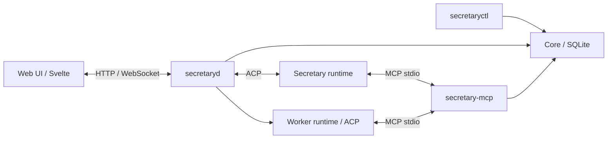

# Secretary

Персональный ассистент на Go: сохраняет непрерывную переписку и делегирует задачи постоянным **Workers** — агентам с отдельными сессиями. Пользователь продолжает разговор с Secretary, наблюдает за выполнением задач в веб-интерфейсе и отправляет уточнения уже созданному Worker.

История переписки, задачи, связи с Workers и результаты сохраняются локально в SQLite. Веб-интерфейс написан на Svelte.

## Что делает

- Сохраняет Personal Conversation и состояние задач между запусками.
- Создаёт Workers для отдельных задач и направляет Follow-up в существующую сессию.
- Показывает активность Worker в реальном времени через WebSocket.
- Позволяет отправлять сообщения во время работы, ставить их в очередь и останавливать выполнение.
- Возвращает результат Worker в основную переписку и сохраняет его в SQLite.
- Предоставляет MCP-инструменты с отдельными ролями для Secretary, Worker и Child Worker.
- Подключает runtime агентов через ACP; модели и профили задаются в конфигурации.

## Стек

**Go**, SQLite (`modernc.org/sqlite`), HTTP API, WebSocket, JSON-RPC, MCP, ACP; **Svelte**, Vite и Tailwind CSS для веб-интерфейса.

## Архитектура



- `secretaryd` — демон: HTTP API, веб-сессии, WebSocket и управление runtime.
- `secretaryctl` — CLI для операций с состоянием Secretary.
- `secretary-mcp` — MCP-сервер по stdio; доступные инструменты зависят от роли и capability.
- `internal/core` — SQLite, миграции, переписка и жизненный цикл задач.
- `internal/acp` — JSON-RPC-соединение с процессом агента, события и управление сессиями.
- `internal/webapi` — веб-сессии, сообщения, Workers и WebSocket.
- `internal/e2e` — проверки сценариев взаимодействия компонентов.
- `web/` — пользовательский интерфейс и отдельная Control Room для диагностики.

## Запуск

Для штатного launcher нужны **macOS**, `zsh`, `mise` и настроенный runtime агента. Версия Go **1.27.1** закреплена в `.mise.toml`. Текущий быстрый старт использует fx; вход в провайдера выполняется средствами выбранного runtime.

```sh
git clone https://github.com/GitHubFoxy/secretary.git
cd secretary
export PATH="$HOME/.local/bin:$PATH"
./secretary setup
./secretary doctor
./secretary start
```

Setup собирает демон, CLI и MCP-сервер, создаёт конфигурацию и локальные профили. Команда `start` открывает веб-интерфейс на `http://127.0.0.1:8081`.

```sh
secretary status
secretary logs
secretary restart
secretary stop
```

Локальные данные находятся в `~/.local/share/secretary/`: `secretary.db`, `config.toml`, профили и журналы. Bootstrap-ссылки и credentials предназначены для владельца; не публикуйте их. Workers выполняют команды в доверенной локальной среде с доступом к файлам.

Подробные инструкции: [быстрый старт](docs/quickstart.md), [конфигурация](docs/configuration.md), [контракты системы](CONTEXT.md).

## Проверки

```sh
mise exec -- go test ./...
./scripts/secretary-cli-test.sh
```

[Критерии проверки релиза](docs/phase3-release-gate.md) описывают сценарии запуска, делегирования, наблюдения за Workers и восстановления состояния.
